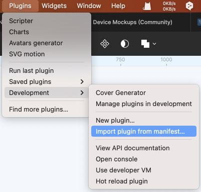
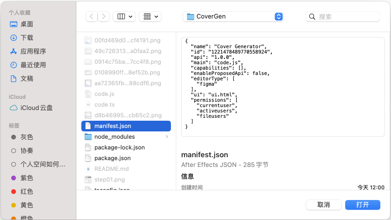
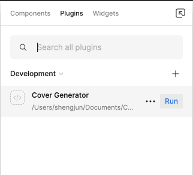
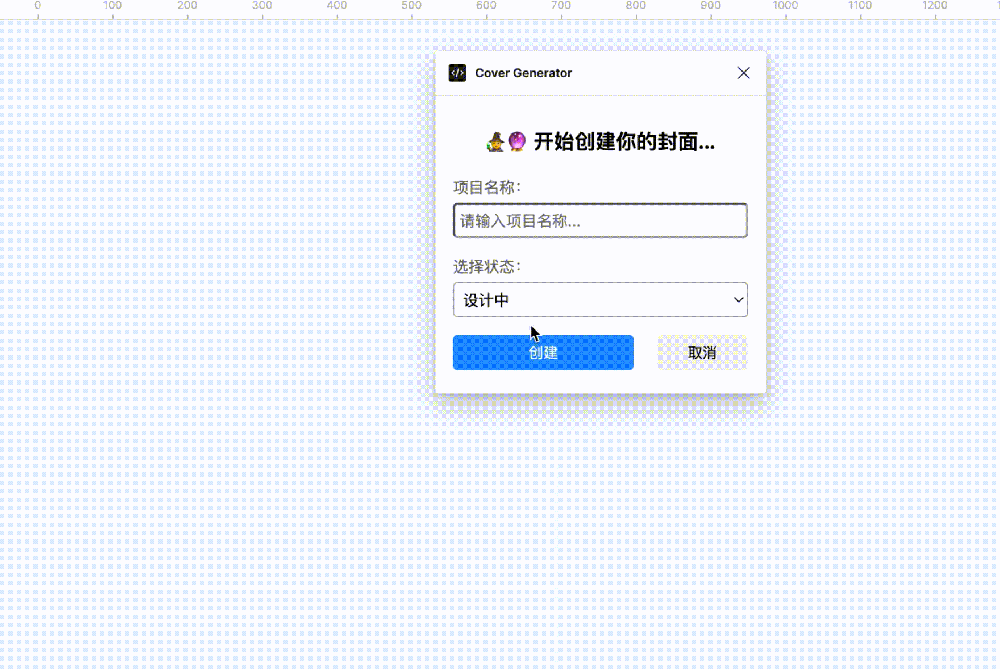

# 使用手册

1. 点击‘Download Zip’下载插件安装包到本地。

2. 打开Figma,选择开发者->从Manifest导入插件

3. 选择manifest.josn文件，点击打开

4. 点击运行插件

----

# 功能介绍
1.  输入项目名称
2.  允许切换项目状态
3.  自动填充设计师名称（并且在前面添加一个emoji）
4.  自动填充当前的创建时间
5.  自动将当前生成的封面设置为项目封面，退出列表模式可预览（有时间差）

<!-- <!DOCTYPE html>
<html>
<head>
    <title>Video Example</title>
</head>
<body>
    <video controls>
        <source src="GenCover.mp4" type="video/mp4">
        <!-- 支持多个不同格式的视频源，以备不同浏览器支持 -->
        <!--<source src="video.webm" type="video/webm">-->
        <!--<source src="video.ogv" type="video/ogg">-->
        Your browser does not support the video tag.
    </video>
</body>
</html> -->

版本记录：
V1.0 自动填入用户名和创建时间，同时将生成的图层设置为项目封面

